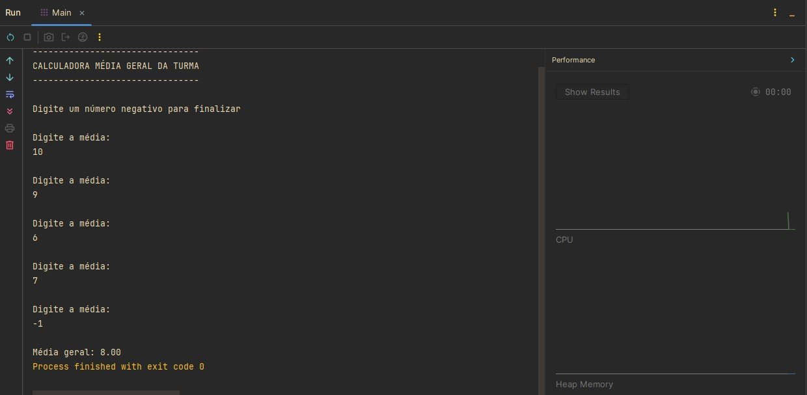
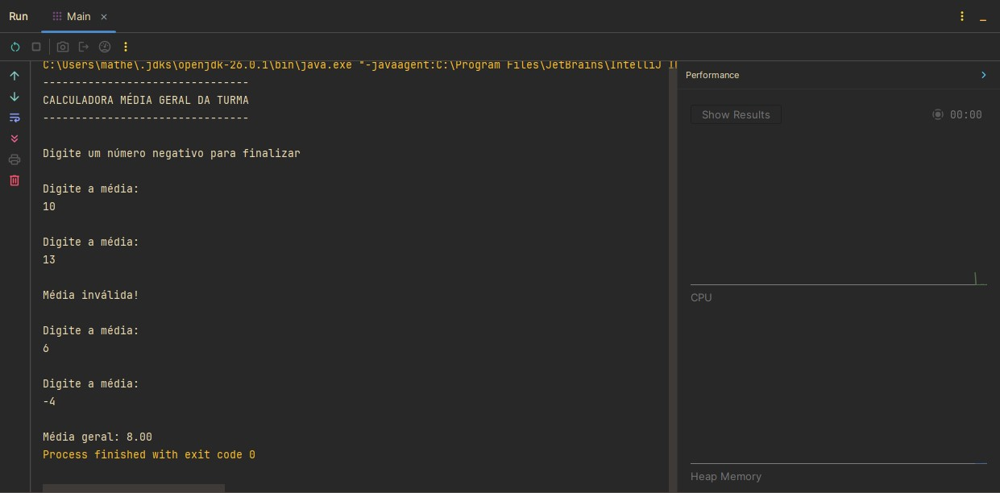
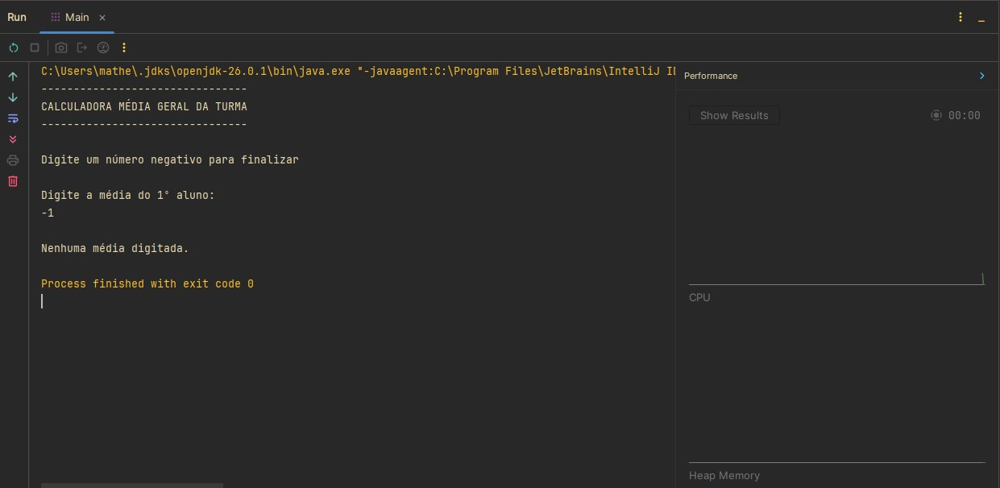

# Calculadora da Média Geral da Turma em Java

Projeto desenvolvido durante meus estudos de **Java** com o objetivo de praticar estruturas de repetição, validação de entradas e cálculos utilizando a linguagem.

## Sobre este repositório

Este repositório faz parte da minha jornada de aprendizado em Java. Meu objetivo é documentar os principais exercícios e projetos desenvolvidos ao longo dos estudos, registrando minha evolução na linguagem e construindo um portfólio para oportunidades de estágio e desenvolvimento de software.

## Descrição

O programa calcula a **média geral de uma turma** a partir das médias finais informadas pelo usuário.

As médias são inseridas uma a uma e o programa permanece em execução até que seja informado um número negativo, indicando o fim da entrada de dados.

### Entrada das médias

O usuário informa a média final de cada aluno, respeitando o intervalo de **0 a 10**.

Exemplo:

| Aluno | Média |
| ----: | ----: |
|     1 |   8.5 |
|     2 |   7.0 |
|     3 |   9.2 |
|     4 |   6.8 |

Após finalizar a entrada das médias, o programa calcula e exibe a média geral da turma.

### Estrutura de repetição

O programa utiliza a estrutura `do-while`, garantindo que pelo menos uma entrada seja realizada antes da verificação da condição de parada.

A execução é encerrada quando o usuário informa um número negativo.

### Validação de entradas

O programa realiza verificações para garantir que apenas médias válidas sejam consideradas no cálculo.

São tratadas as seguintes situações:

* médias entre **0** e **10**, que são adicionadas ao cálculo;
* médias superiores a **10**, consideradas inválidas e desconsideradas;
* números negativos, utilizados para encerrar a entrada de dados.

## Tecnologias e conceitos utilizados

* IntelliJ IDEA
* Java
* Scanner
* Locale
* Estruturas de repetição (`do-while`)
* Estruturas condicionais (`if` e `else if`)
* Variáveis e tipos primitivos
* Operadores relacionais e lógicos
* Entrada e saída de dados
* Validação de entradas

## Demonstração

<p align="center">
  
</p>
<p align="center">
  
</p>
<p align="center">
  
</p>

## Estrutura do projeto

```text
java-media-geral-turma/
│
├── images/
│   └── captura1.jpg
│   └── captura2.jpg
│   └── captura3.jpg
│
├── Main.java
│
└── README.md
```

## Objetivo

Praticar conceitos fundamentais da linguagem Java, especialmente:

* leitura de dados utilizando a classe `Scanner`;
* utilização de estruturas de repetição;
* utilização de estruturas condicionais;
* validação de entradas do usuário;
* manipulação de acumuladores e contadores;
* realização de cálculos utilizando laços de repetição.

## Aprendizados

Durante o desenvolvimento deste projeto, pratiquei:

* utilização da classe `Scanner`;
* configuração da localidade com `Locale`;
* manipulação de variáveis e tipos primitivos;
* utilização da estrutura de repetição `do-while`;
* utilização de estruturas condicionais para validação de dados;
* implementação de acumuladores e contadores;
* cálculo da média geral de uma turma;
* organização básica de um programa em Java.

## Como executar

Clone este repositório:

```bash
git clone https://github.com/SEU-USUARIO/java-media-geral-turma.git
```

Acesse a pasta do projeto:

```bash
cd java-media-geral-turma
```

Compile o programa:

```bash
javac Main.java
```

Execute:

```bash
java Main
```

## Autor

**Matheus Ferreira Lopes**

Estudante de Desenvolvimento de Software Multiplataforma (FATEC Diadema)
